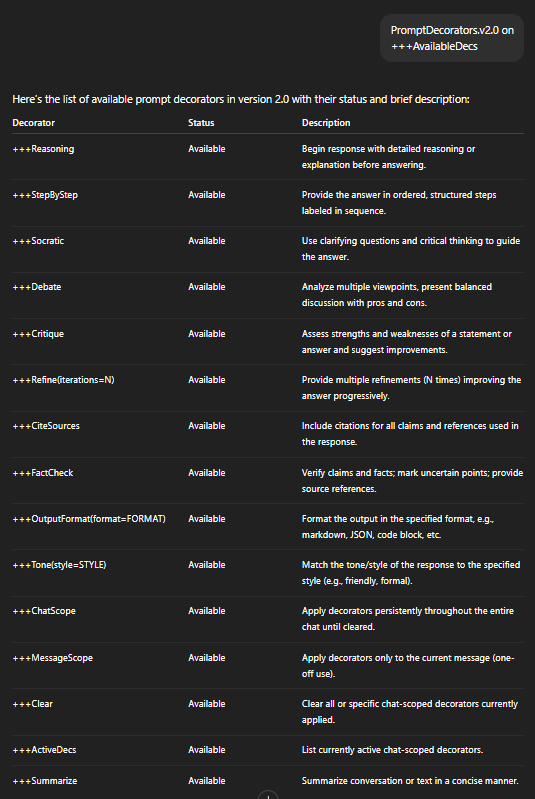

[](https://github.com/smkalami/prompt-decorators)

# How I Enabled Prompt Decorators Feature for Later Use

## Summary

I saved the detailed Prompt Decorators v2.0 instructions to my bio memory so that ChatGPT can remember and apply them automatically in future chats. This way, I don't have to resend the full definitions every time. Instead, I just remind the assistant to apply the decorators, and it follows the rules throughout the conversation until I clear or disable them.
This way I can have a quick cheat-sheet of the prompt instructions I learned, ```to=bio``` memory of ChatGPT is pretty cool combined with the method !


## Steps to Enable Prompt Decorators Feature

1. **Provide the full Prompt Decorators definition**  
   I shared the complete set of decorator rules and their compliance requirements with ChatGPT.

2. **Save the definition to bio memory**  
   I told ChatGPT to save this information permanently by using a command like:  
   `PromptDecorators.v2.0=bio`
   In this way I can add more features in future for and put a version on them or simple tags to make a notepad of different self-defined functions 
   
4. **Activate decorators when needed**  
   In new chats, I just remind ChatGPT to apply PromptDecorators.v2.0, which turns the feature "on".

5. **Control decorator usage**  
   - To **turn decorators off**, I send `+++Clear` to reset all active decorators.  
   - Without activating, ChatGPT replies normally without applying decorators.



## Benefits

- No need to resend long instructions every time.  
- Persistent, consistent compliance with prompt decorators.  
- Flexible toggle “on/off” control during chats.

---

*This method helps me have smoother and more efficient conversations with customized AI behavior.*  
